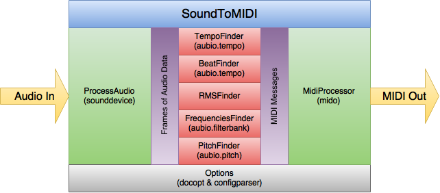

============
Architecture
============

Options
=======
Just about everything (too much) is configured via the Options class. Defaults
and command line options are handled via the docopt library, which uses a
very verbose docstring to work. Options can also come from an inifile via the
confirparser library. Right now the priority for configuration options is:

inifile > command line > docstring defaults

In the future, the priority will be:

command line > inifile > docstring defaults

The dictionary of options, sans the double hyphen prefix in the case of those
coming in via docopt, are used throughout the package. No advance cleanup
is taking place to, for example, turn a value into an string into an int.

Note that for any options dealing with MIDI, both int and hex values are
allowed and will be translated as needed.  In other words, both 0x7F and 127
are both acceptable.

ProcessAudio
============
ProcessAudio initializes the sound card for record as well as the various
audioprocessors that have been turned on. Once started, a callback loop takes
frames of incoming audio data and sends a copy of each frame as an array to
the live audio processors.

TempoFinder
===========
The TempoFinder receives frames of audio data from ProcessAudio. Depending on
how it has been configured, it may accumulate some multiple of these audio
frames before moving on. Once a threshold amount of audio has been received,
it uses the aubio tempo class to try to get the BPM of the audio. Configurable
averaging takes place to keep radical values from throwing things off.
Assumptions are made that extremely low BPM values should be doubled, and
likewise extremely high values should be halved. After that, values lower than
a BPM of 60 or greater than a BPM of 187 are ignored.

If the BPM value has changed from the last time this has run, MIDI messages
are prepared with the new information. Due to the 7 bit nature of MIDI, there
are several ways to encode the BPM into MIDI messages, which can be configured.
Once the message or messages are prepared, they are handed off the
MidiProcessor and the TempoFinder object waits for new frames of audio data
to go through all of this again.

BeatFinder
===========
The BeatFinder receives frames of audio data from ProcessAudio. Depending on
how it has been configured, it may accumulate some multiple of these audio
frames before moving on. Once a threshold amount of audio has been received,
it uses the aubio tempo class to find out if there is a beat in the audio
frame. The BeatFinder object can be configured to count the beats, so that
the first beat is assigned a value of 0, the second beat a value of 1, and so
on, repeating as necessary.  The default is to count 8 beats in a row, assign
each as a value 0-7, then looping back around to 0 and starting again.

MIDI messages are prepared with the beat information with the beat location
as the value of the message and are handed off the MidiProcessor. The
TempoFinder object waits for new frames of audio data to go through all of this
again.

Though it doesn't exist yet, this is where MIDI clock messages should
originate. The MIDI spec calls for 24 clock messages to be sent per quarter
note. To implement, we will need to measure the time elapsed between the
previous two quarter notes--for 120BPM, that would 0.5 seconds. We would then
send clock messages at 1/24th of this time (0.5 / 24 = 0.0208333 seconds).
This will require a separate thread, and even then, with all of the stuff
that is happening with processing the sound, I'm not sure how well it would
actually work.

RMSFinder
===========
The RMSFinder receives frames of audio data from ProcessAudio. Depending on
how it has been configured, it may accumulate some multiple of these audio
frames before moving on. Once a threshold amount of audio has been received,
some math is done on the accumulated data to determine the root-mean-square, or
RMS. Aubio is not used for this, it's just a function that is very likely
wrong. But in the end, loud sound comes out near 127 and quiet sound is
near 0, so it's good enough for the moment.

MIDI messages are prepared with this value and is handed off the MidiProcessor.
The RMSFinder object waits for new frames of audio data to go through all of
this again.

FrequenciesFinder
=================
The FrequenciesFinder receives frames of audio data from ProcessAudio.
Depending on how it has been configured, it may accumulate some multiple of
these audio frames before moving on. Once a threshold amount of audio has been
received, this is sent to the aubio phase vocoder, which returns data that is
sent to the aubio filterbank.

Several things on this. The aubio phase vocoder is essentially a wrapper
around a FFT function (from FFTW, I believe). By design, the goal is to align
frames of data so that overlaps with previous audio frames match with the
current one. Unfortunately, this creates something of a memory leak that I've
yet to eliminate. While you do want to hang on some amount of previous frames
for this matching process, after an hour there is no need for the previous
frames of audio to still be sticking around. I've not yet figured out how to
fix this. Just know that if you intend to use this audio processor that you
should keep an eye on how much memory is being used. For short time periods,
it may not be a problem, but if the idea is to leave this running for a long
period of time unpredictable things might happen.

The results from the phase vocoder are fed to the aubio filterbank, which
determines the strength between audio bands.  The definition of those audio
bands is configurable, with presets available third-octave (30 bands) and
octave (10 bands) that is pretty close to what you see on graphic equalizers.

The results of each band in the filterbank are translated into values 0-127.
The peak of 127 is assumed to be the highest value ever received in that bank,
and everything else is considered a fractional portion of that. What this means
practically is that as program is running is that the meaning of what a value
of, say, 60 in band 0 means will change over time.  But, as with RMS, you
do get a decent enough value to do something with.

A MIDI sysex message is prepared, with each band adding a single value of 0-127
to the message, moving from the lowest frequency bands to the highest.  The
message is handed off the MidiProcessor and the FrequenciesFinder object
waits for new frames of audio data to go through all of this again.

PitchFinder
===========
The PitchFinder receives frames of audio data from ProcessAudio. Depending on
how it has been configured, it may accumulate some multiple of these audio
frames before moving on. Once a threshold amount of audio has been
received, this is sent to the aubio pitch object, which returns a midi note
value 0-127. Well, actually, sometimes it sends something beyond that, so those
values are ignored.

MIDI notes start at 0, with is "C", and each octave occupies 12 slots in this
sequence:

C  C#  D  D#  E  F  F#  G  G#  A  A#  B

At 12, it starts again, and so on up to 127, or a little less than 11 octaves
total.  Middle C on a piano is a value of 60.

The aubio pitch object can return any of these values, but quite often it
struggles to determine the proper octave, so you can see oscillation between,
say, 60 and 72.  Both are a C note, but the octave is unclear.  For this
reason, you can opt to just send 12 notes where the octave is basically
ignored but the fundamental pitch is correct. You can also opt to shift these
12 notes to somewhere else on the scale--perhaps to start at the middle C
position so that the possible notes are just 60-71.

Be realistic about expectations here. Chords seem to really throw pitch
detection off.  Often you will see oscillation between all of the notes that
make up the chord.

This information can be sent as MIDI control or sysex messages, but in this
one case, you can also send this as actual MIDI note values. In this case, you
may want to send both a note on message when a new pitch is found as well as
a note off message to turn off the previous pitch.

As with everything else, once there is a change in pitch, the configured MIDI
messages are passed off to the MidiProcessor and the whole process starts
again.

MidiProcessor
=============
The MidiProcessor receives MIDI messages from the audio processors and sends
these out to the configured MIDI port.  No prioritization of incoming
messages is taking place, nor is any buffering. Basically it's just a fire
hose that shoots out messages.

When the SoundToMidi package is running on the same computer as the software
that is listening for these messages, sending things out and receiving them
on an internal MIDI bus is definitely not the most efficient way to do
things. This class could be expanded to take advantage of different ways of
doing this better and faster.
